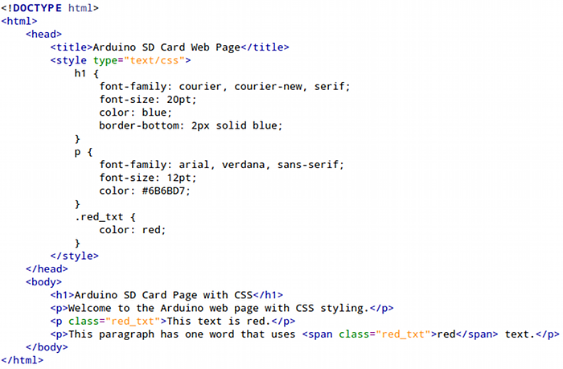

# Curso de Ingeniería de Datos con Python

- [Curso de Ingeniería de Datos con Python](#curso-de-ingenier%C3%ADa-de-datos-con-python)
  - [¿Qué es la Ciencia e Ingeniería de Datos?](#%C2%BFqu%C3%A9-es-la-ciencia-e-ingenier%C3%ADa-de-datos)
  - [Roles](#roles)
  - [Configuración del ambiente](#configuraci%C3%B3n-del-ambiente)
  - [Jupyter Notebook](#jupyter-notebook)
  - [Tipos de datos](#tipos-de-datos)
  - [Fuentes de datos](#fuentes-de-datos)
    - [Links de fuentes de datos](#links-de-fuentes-de-datos)

## ¿Qué es la Ciencia e Ingeniería de Datos?

La _Ciencia de Datos_ es la disciplina que se encarga de _extraer conocimiento de los datos disponibles_. Casi siempre cuando te realizas una pregunta sobre datos estas fuentes se encuentra escondidas, ocultas o de difícil acceso. A nuestro alrededor hay datos en tu computadora, mesa, reloj, etc.

> Los datos están por todas partes.

La Ciencia de datos es _multidisciplinaria_. A diferencia de muchos otros ámbitos profesionales dentro del mundo de la tecnología, cuando hablamos de un científico de datos es una persona que sabe de matemáticas, ingeniería de software y sabe de negocios.

Se apoya en la _Computer science_, _Matemáticas_(Regresiones e Inferencias),

También se auxilia de:

- Bases de Datos
  - SQL y NoSQL
- Análisis de texto y procesamiento de lenguaje natural
- Análisis de redes
- Visualización de datos
- Machine learning e Inteligencia Artificial
- Análisis de señales digitales
- Análisis de datos en la nube(Big Data)

## Roles

Existen por lo menos tres diferentes roles para tener un _pipeline_ completo de ciencia de datos. Este curso trata sobre el primer rol:

- __Data engineer__
  - Se encarga de obtener los datos
  - Limpiarlos y estructurarlos para posterior análisis
  - Crear pipelines de análisis automatizado
  - Utilización de herramientas en la nube
  - Análisis descriptivo de los datos.

- __Data scientist__
  - Una vez tiene los datos se encarga de generar el análisis matemático de ellos
  - Encuentra las relaciones entre las variables, las correlaciones, las causas
  - Genera los modelos predictivos y prescriptivos.

- __Machine Learning engineer__
  - Se encarga de llevar las predicciones a escala
  - Subirlos a la nube
  - En la nube, generar muchas predicciones
  - Se encarga de mantener la calidad del modelo.

## Configuración del ambiente

_Anaconda_ es una instalación de _Python_ que ya trae preinstalado todos los paquetes necesarios para tu labor en la Ciencia de Datos, tiene más de 1400 paquetes. Nos permite configurar ambientes virtuales para poder utilizar diferentes versiones de nuestros paquetes.

```bash
conda --version # para conocer la versión y saber que lo tenemos instalado
conda --help # nos da todos los comandos que podemos usar.
conda list # nos lista todos los paquetes que Anaconda instaló.
```

Una buena práctica es generar un ambiente virtual por cada proyecto, los ambientes virtuales nos permiten generar varios proyectos con diferentes versiones de la librería sin generarnos errores de compatibilidad. Tradicionalmente en Python se utiliza `virtualenv`.

```bash
conda create --name [nombre-del-proyecto] [librerías-a-usar]
conda create --name platzi-data beautifulsoup4 requests numpy pandas matplotlib yaml
```

```bash
source activate platzi-data # Para activar
source deactivate # Para salir

conda env list # nos muestra los ambientes virtuales que tenemos
conda remove --name [nombre-del-proyecto] --all # eliminar nuestro entorno virtual con todos nuestros paquetes
```

## Jupyter Notebook

Algo interesante que tenemos con _Anaconda_ es que nos trae _Jupyter Notebooks_.

Jupyter Notebooks es un __entorno de programación__ en el cual podemos mezclar ejecución de _código en vivo_, _visualizaciones_ y añadir _markdown_.

Para inicializar nuestro servidor de jupyter, escribimos en el command line: `jupyter notebook`.

Jupyter Notebook tiene diferentes tipos de celdas en las cuales podemos escribir código o markdown. Si queremos ejecutar nuestro código hacemos `ctrl + enter` y si queremos ejecutar y añadir una nueva celda `shift + enter`.

Jupyter Notebook tiene dos modalidades, la modalidad de __edición__ y __navegación__.

## Tipos de datos

Los datos vienen en mucha formas y estas formas las podemos clasificar de diferentes maneras, permitiéndonos poder aplicar técnicas distintas a cada uno de los tipos de datos.

Los primeros datos son los primitivos.

- int,
- str,
- bool,
- float,
- hex,
- oct,
- datetime,
- objetos especiales

```python
from datetime import datetime

integer_type = 42
float_type = 3.14159
bool_type = False
hex_type = 0xff
oct_type = 0o23
today = datetime.now()
str_type = 'Jesus'
```

Tenemos clasificaciones ulteriores como:

- Los datos estructurados: son los más fáciles de acceder
  - Bases de datos
  - Data warehouses


- Semi estructurados: son con los que podemos utilizar APIs
  - json API
  - Datos tabulares (csv, excel)
- no estructurados: la mayoría de datos que vamos a tener disponibles están clasificados aquí
  - HTML
  - Texto libre
  - Currículums vitae
  - Imágenes, audio, social media
  - Datos científicos



- Cualitativos vs cuantitativos
- Tiempo real vs históricos

## Fuentes de datos

- __Web__

Es una mina enorme con datos financieros, de startups, del clima, precipitación fluvial, astronómicos, de negocios, etc.

- __APIs__

Endpoints que viven en la web y nos devuelven JSON. Por ejemplo, la API de twitter, google, facebook.

- __User Analytics__

Son el comportamiento del usuario dentro de nuestra aplicaciones, algo similiar a los que nos ofrece Google Analytics.

- __IoT__

Se ha vuelto una mina espectacular en los últimos años. Como automóviles.

### Links de fuentes de datos

- [El Pais](https://elpais.com/elpais/portada_america.html)
- [Google Cloud Platform](https://console.cloud.google.com/apis/library)
- [Datos Abiertos de México](https://datos.gob.mx/)
- [Dataset Search by Google](https://toolbox.google.com/datasetsearch)
- [Data Catalog for Analysis](https://data.world/)
- [Kaggle, for Data Science](https://www.kaggle.com/)